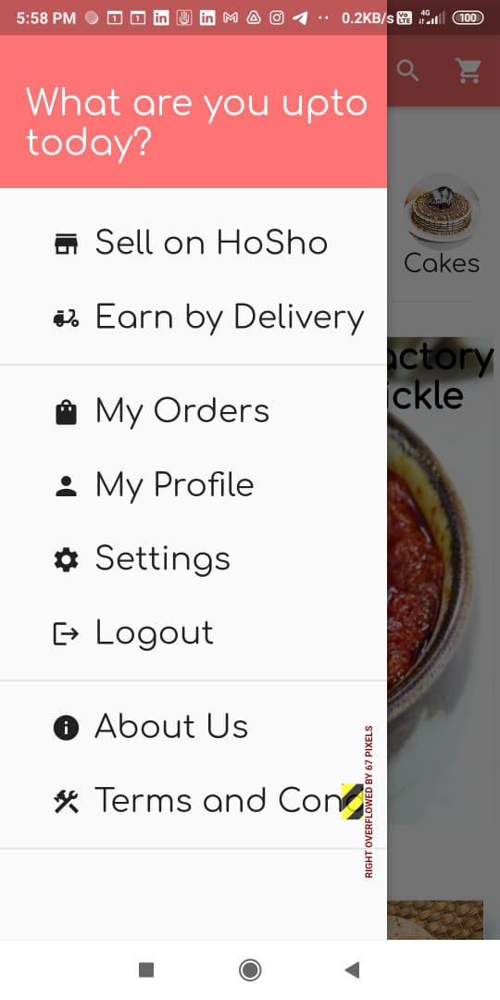
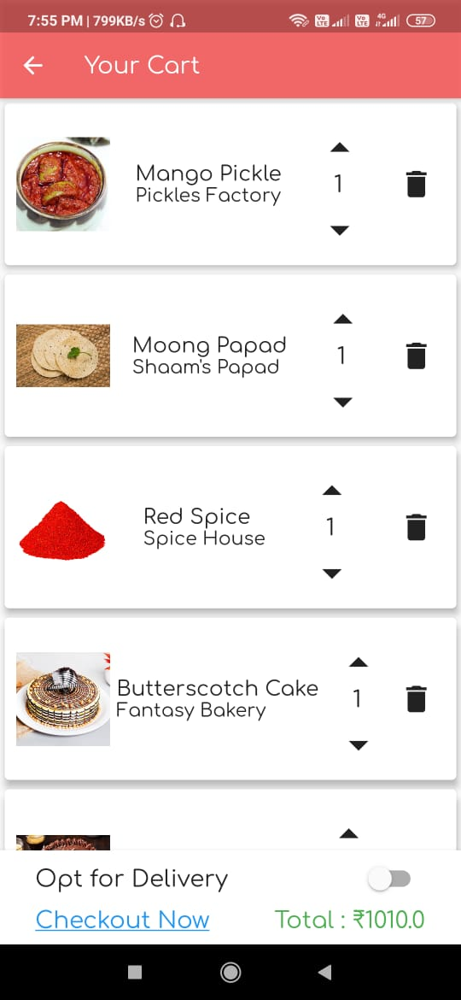
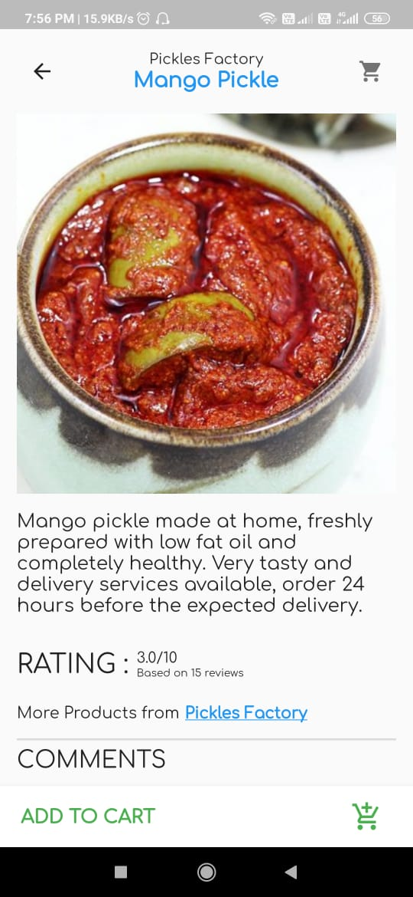

# HoSho


Hosho is an eCommerce application, and a platform for small scale home-vendors, to sell their products to a wider public 
  - Install the app from the github 
  - Currently app is not connected with backend, so, the app password is hardcoded to be 'hello' without qoutes.
  - To register as seller, you only need to enter a shop name, can it get any simpler ?
# Features (server ready)!
  - Registration of user and shop, with email verification
  - All in one Product page with filters and search mode
  - Display Ads for your shop
  - Inhouse Wallet - Hosho Money
  - No hidden charges. we wont charge 20% of what you earn within app. Only Advertisements are charged (that too minimal fees!)
  - Trustworthy reviews and free points for Reviewing products.
  - Automatic refunding incase an order does not get resolved within a certain period

##### Future Prospects
  - Transfer funds from the app wallet directly to bank account
  - Code system for delivery authentication
  - tracker for the delivery person
  - feedback system by gifting HoSho money
  - quality products from sellers by gifting HoSho money
  - add third party delivery Services.

# Why Hosho
> One stop solution for all - be it buyer, seller, delivery person. All these utilities are packaged in a single application, that anyone can use.

### Tech Stack
Paybo was made with love using various technologies combined

* [Flutter](flutter.dev) - Cross platform apps fast & easy!
* [MongoDB Atlas](https://www.mongodb.com/cloud/atlas) - Online NoSQL based storage solution
* [Heroku](https://dashboard.heroku.com/) - Platform as a Service to run any kind of app
* [Python](https://www.python.org/) - Interpreted Programming Language
* [Flask](https://flask.palletsprojects.com/en/1.1.x/) - A micro web framework written in Python.

### Dev Installation 
#### Server
Start a local Mongo Session and update the Url in database/dp.py file.
Install the dependencies and start the server.
```sh
$ cd Ho-Sho/Server
$ pip3 install requirements.txt
$ export FLASK_APP=app.py
$ export FLASK_ENV=development
$ flask run
```
For production environments...
```sh
$ export FLASK_ENV=production
$ flask run
```
> To create some dummy document structure in database, go to HOSTED_URL/init for the first time you run the server

#### App
Install flutter and Android SDK
```sh
$ cd App
$ flutter pub get
$ flutter run
```
This will start the app in debug mode on connecte device.


### Some Ui-Shots





Made with ❤️